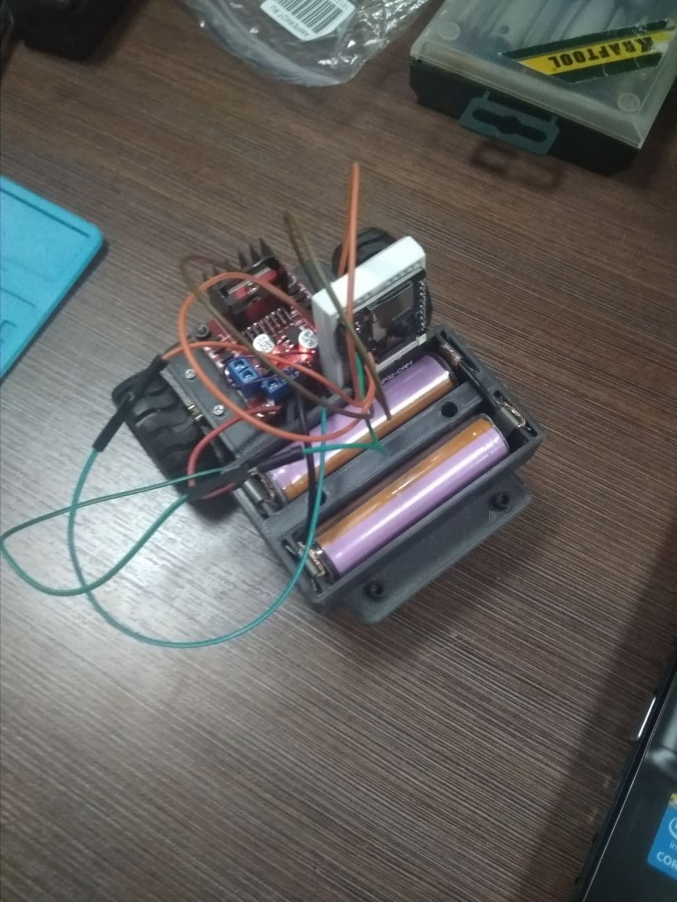

## Intro

Привет, странник (или странница) ^_^

На связи команда Platform 9 &#x00BE;. Мы делаем игру, стирающую грань между воображением и реальностью. 

### В предыдущей серии:

Если ты каким-то образом попал сюда, то, вероятно, интересуешься компьютерными играми. И у меня как раз есть одна занимательная история. Начну с того, что я не имею прямого отношения к геймдеву, но мне нравятся роботы, а также интересны проекты связанные с компьютерным зрением и дополненной реальностью (один из таких проектов лежит в соседнем репозитории https://github.com/lazymanul/image-augmentation). В какой-то момент в голове возник вопрос: а почему, собственно, компьютерные игры должны находиться исключительно внутри компьютера? Быть может пришла пора проломить <s>четвертую стену</s> экран и выбраться наружу? Собрать игровое пространство, которое позволит по-настоящему взаимодействовать с реальностью! Pockemon GO отлично себя показал, но хочется пойти дальше  (где-то здесь на сцену выходят роботы и аугментированные миры, хотя у меня ещё нет полного понимания, как всё это должно заработать вместе). 

Сейчас трудно представить, чем в конечном итоге завершится этот мысленный эксперимент, но мне хочется провести его в любом случае. С другой стороны будет гораздо интересней сделать это в приятной компании ;) Если хочешь поучаствовать -- стучи в дискорд.

## Команда мечты

Кому бы я особенно был рад: 
- <s>3д-дизайнер с интересом к Blender'у</s> - нужно как-то заселить воображаемый мир объектами;
- Web-разработчик - js (чтобы собрать игровой интерфейс) + графическая магия WebGL;
- <s>Мастер нарративов</s> - только крутая история позволит сшить вместе разрозненные фрагменты этой странной игровой реальности.

А также welcome все, кто может придумать себе занятие в таком проекте)

Уровень навыков: начинающий+ 

## Технологический стек
В этом разделе попытаюсь объяснить, из чего хочется сварить компот, о котором я много говорил выше.

Есть понимание, как строить дополненную реальность различными способами (OpenCV, AR.js). На фото немного шакальный динозавр, который рендерится в отмеченном маркером месте в режиме реального времени.

Есть робот, который довольно близок к завершению. Электрическая схема:

колёсная платформа (+ ещё некоторые детали, не попавшие на фото)

